# Assignment 2 Report
## Repo Structure
Following is the repo structure
```
assignment-2-ed24s401-ns26z150/
├── AI-DISCLOSURE.md
├── CONFLICT.md
├── Dockerfile
├── README.md
├── SCR-20260218-nlyy.png
├── SCR-20260218-nmgy.png
├── SCR-20260218-nmnd.png
├── assets/
├── assignment2.mp4 # this is the screencast recording of this assignment
├── docker-compose.yaml
├── docker-stack.yaml
├── run.sh
├── server/
│   ├── __init__.py
│   ├── main.py
│   ├── pydantic_schemas/
│   │   ├── __init__.py
│   │   ├── health.py
│   │   ├── image.py
│   │   ├── ner.py
│   │   ├── translate.py
│   │   └── tts.py
│   ├── requirements.txt
│   ├── routes/
│   │   ├── __init__.py
│   │   ├── bhashini.py
│   │   ├── health.py
│   │   ├── image.py
│   │   ├── ner.py
│   │   ├── translate.py
│   │   └── tts.py
│   └── utils/
│       ├── __init__.py
│       └── id.py
├── tester.log
└── tester.py
```


## Part 1

### Setting up the Project

- Clone the repository.
- `cd` to repository
- Run the below command to create python3 virtual environment

  ```
  python3 -m venv venv
  ```

- Activate the virtual environment.

  ```
  source venv/bin/activate
  ```

- Run the below command to install all requirements.

  ```
  pip3 install -r  server/requirements.txt
  ```

  - Use `pip` if you have `pip`.

- We are using higgingface for NER task. Please install `pytorch` cpu using the below command.

  ```
  pip3 install torch --index-url https://download.pytorch.org/whl/cp
  ```

  - This is important.

- Create a `.env` and put all the environment variables as in `.env.example`. For any information related to this file, please do not hesitate to contact the developers! :)

- Now you are ready to run the app.
- Use the below command.

```bash
cd server && python3 main.py
```

- Now enjoy the API by going to http://localhost:8000/docs, where 8000 is the value of PORT variable in `.env` file.
- Though, below is the api information.

### API Information

- In this assignment We have used FastAPI for api building.
- The endpoints are as follows.

- `BASE_URL=http://localhost:8000`

- Check the health

  ```
  GET /health
  ```

- API for Named Entity Recognition (NER)
  - We are using huggingface `dslim/bert-base-NER` model for NER.

  ```
  POST /ner
  ```

  - Requires `text` as json body.
  - Returns NER json data.

- API for Translation.
  - For translation, we are using `Bhashini`.

  ```
  POST /translate
  ```

  - Requires `text`, `source_language` `target_language` as json body.
  - Returns translated text.

- API for Text to Speech (TTS).
  - For TTS, we are using `Bhashini`

  ```
  POST /tts
  ```

  - Requires `text`, `language` and `gender` (for audio) as json body.
  - The API returns base64 audio string. You can use [this](https://base64.guru/converter/decode/audio) url to convert it to audio. This is `Bhashini` standard for audio response. TIf you are running locally, you can check generated audios in `server` directory, as audio are saved with timestamps.

- API for image generation
  - For image generation, we are using `fal.ai`.

  ```
  POST /image
  ```

  - Requires `prompt`, `width` and `height` (for image to be generated) as input.
  - It returns a list of `image_urls`.

- All api endpoints return hostname as `container_id` for host identification.

## PART 2: Dockerization and Swarm Optimization

### 1. Dockerization

- We created `Dockerfile` with base image `python:3.11-slim`.
- We load environment variables directly from the `.env` using `docker-compose.yaml`. By default `docker compose up --build` reads the variables directly from `.env` file which provides env-var security. It runs the container on the image with variables loaded.

### Docker Swarm Deployment

- We use `aws` EC2 services for swarm deployment.

- We first create security groups following the resources provided in the problem statement.

  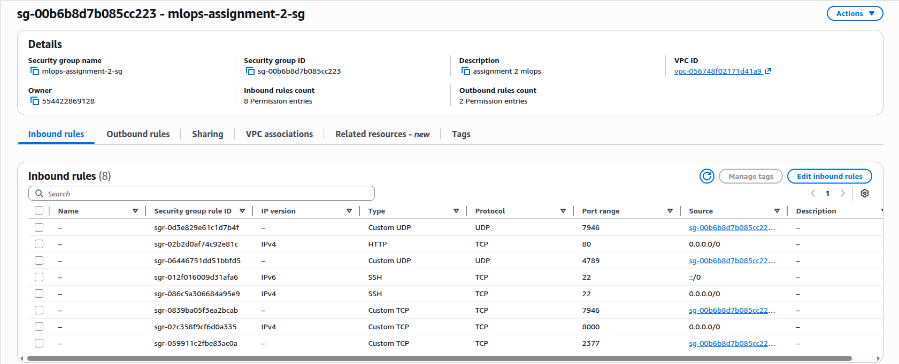

- The we create two EC2 instances

  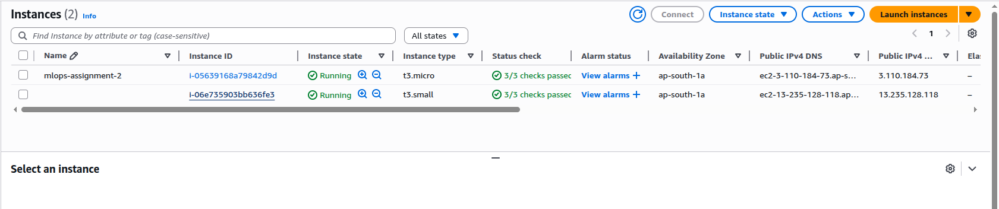

- After this we bring the repo in both the instacnes, so that we can access the project and respective docker files.

- Setup the `.env` file in both the instances, so that it can be used while running containers.

- We install docker in both the instances, by following official documentation

- One instance we select as manager and using `docker swarm init`, initialize manager, the command and output is shown in image below

  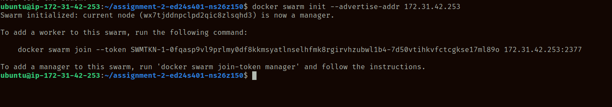

- From other instance, we join as worker.

  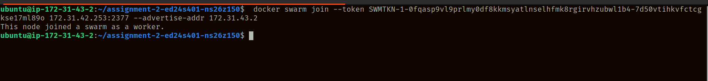

- The output of `docker node ls` from manager/leader can be seen below .

  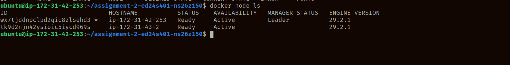

- In the worker instance, we build the image using `Dockerfile` and command

```bash
docker compose build
```

- Now the image is built in the worker.

- In the manager instance, we run the stack as follows:
  - Load the .env file in environment.

  ```
   set -a; . ./.env; set +a
  ```

  - Run the docker stack as follows

  ```
  docker stack deploy -c docker-stack.yaml api
  ```

  - Our stack name is api, and it uses `api:latest` image

  - The output of our commands can be seen below in picture.

    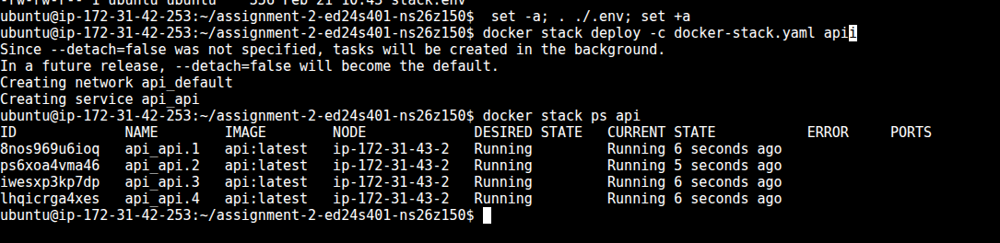

  - Output of the `docker node ls` on manager

    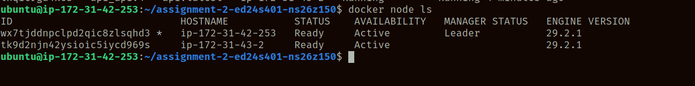

- Output of ` docker service ls` on manager node.

  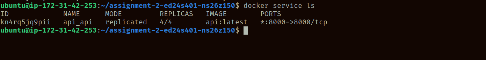

- Then we run `docker ps` in worker, the output is as follows

  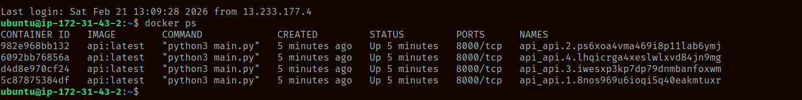
  - You can see hitting these endpoints in `tester.log`, created by running `tester.py` on enpoint `GET /health`. (We have used this endpoint to save on computation, as we have experienced worker overload).

### Examples

- Using the public endpoint of worker in browser, we have tested the api for 4 main tasks.

#### Named Entity Recognition

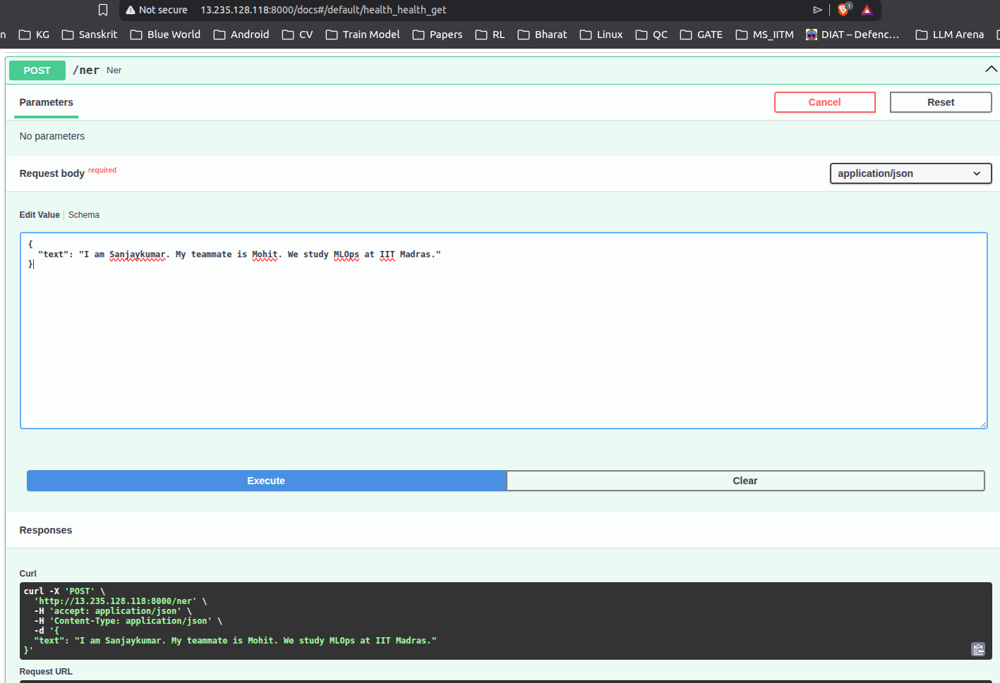

- output: [NER JSON Response](assets/response_1771671895366.json)

#### Translation

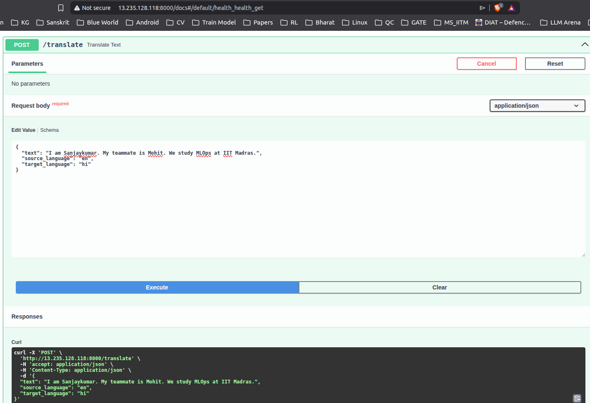

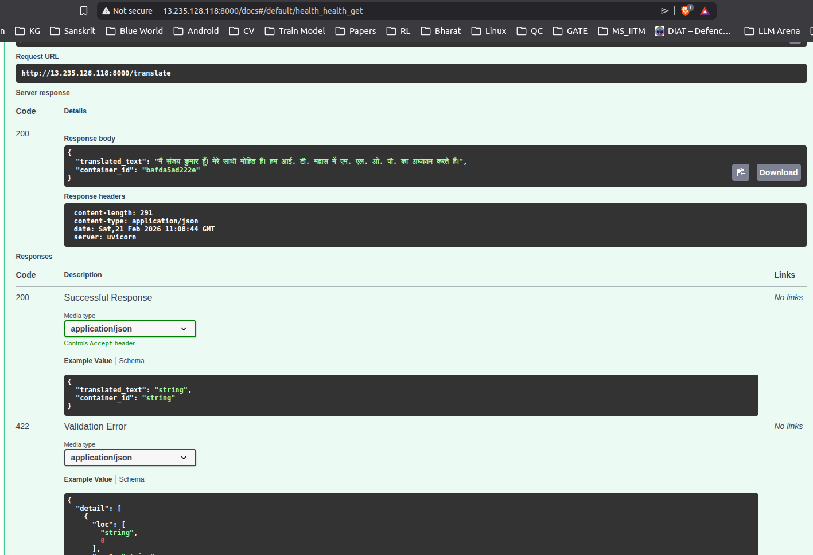

#### Image Generation

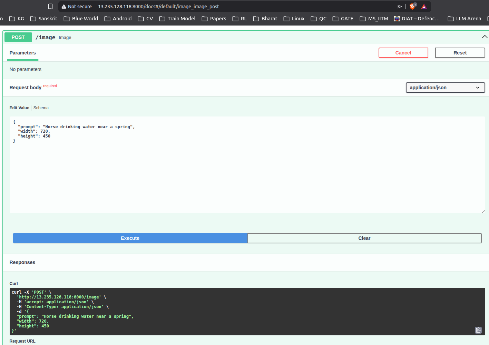

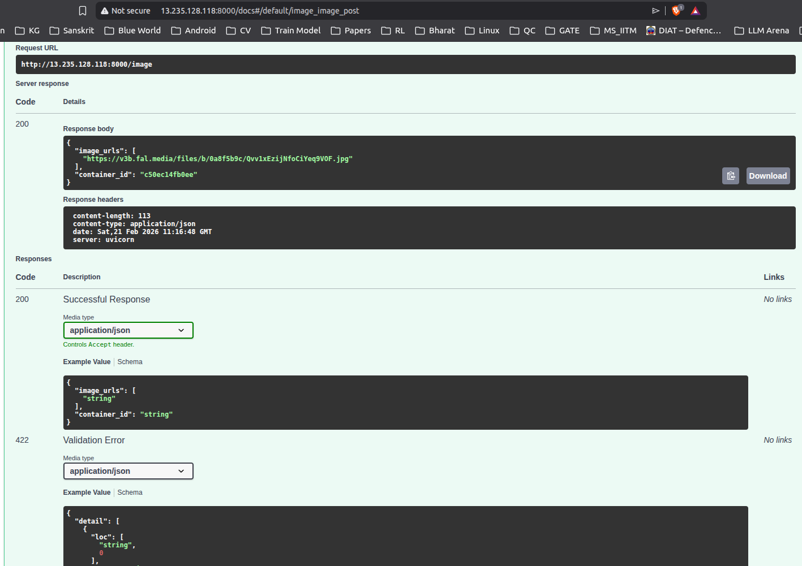

[Generated Image here](https://v3b.fal.media/files/b/0a8f5b9c/Qvv1xEzijNfoCiYeq9VOF.jpg)

#### Text to Speech

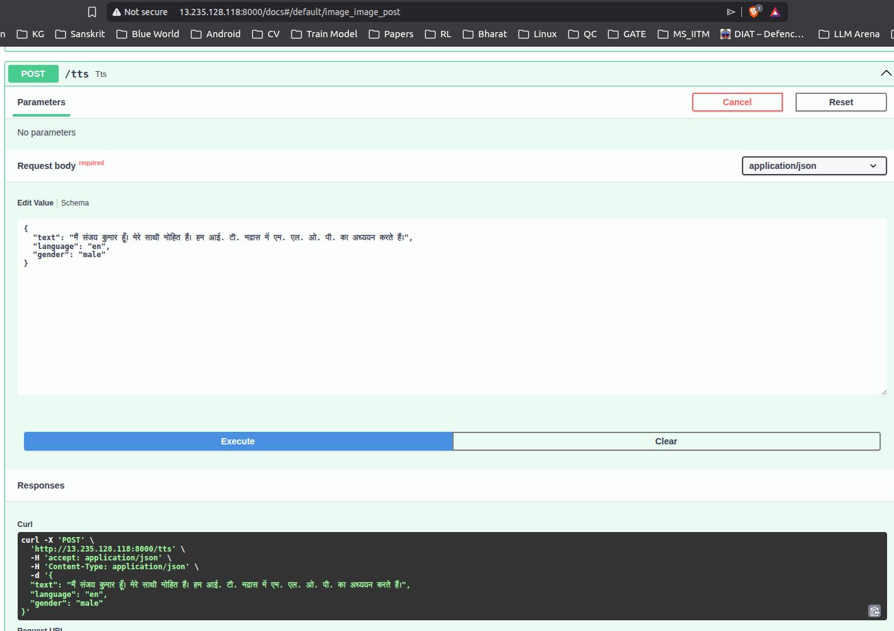

- output: [Audio](assets/tts_hindi.wav)

- The audio is converted from base64 response to audio using base64.guru

* Note: We have run `docker stack deploy` twice, becuase the EC2 instance got overloaded as a result of 4 replicas on 2 vCPU compute. So, in the reponse you might see different container ids than in output of `docker ps` from worker.

* The `tester.py` uses latest deployment. So, there is difference in container ids.
